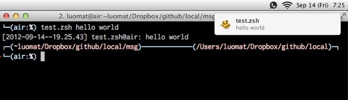

# msg README

This is a zsh function that I use a lot in other shell scripts. The purpose is to alert me to things using
[growlnotify][] in addition to 'echo'.

It also sends a message to 'echo' including a timestamp, and logs that output as well.

You can see an example of the output here:

[growlnotify]: http://growl.info/extras.php#growlnotify

